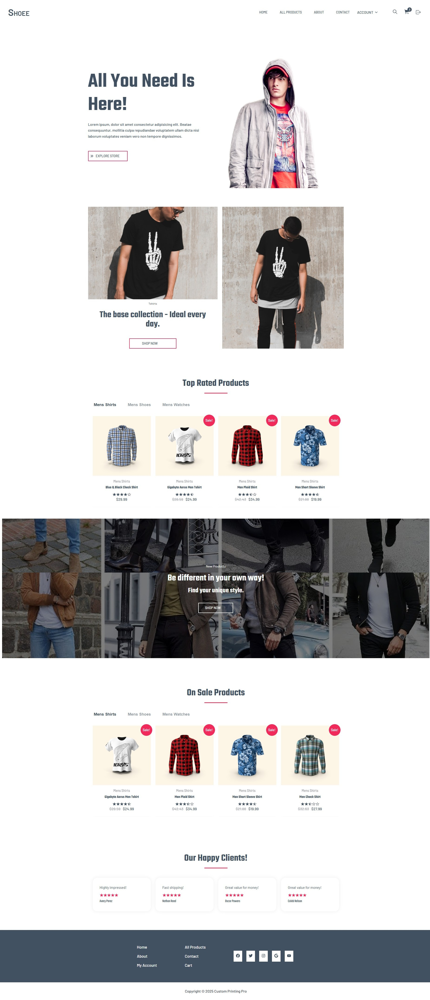

# **Shoee - Modern Ecommerce Platform**

> **Shoee** is a modern **Ecommerce platform** specializing in **men's clothing, watches, and shoes**.  
> Built for **performance, security, and a seamless shopping experience**.

---

## **📸 Screenshots**
| **Desktop View** | **Mobile View** |
|-----------------|----------------|
|  |  |

---

## **🚀 Live Demo**
🔗 **[Visit Shoee Live](https://shoee.pages.dev)**  

---

## **🛠️ Tech Stack**
### **Frontend**
- **React.js** (Hooks, Context API)  
- **React Router Dom** (Navigation)  
- **Redux Toolkit** (State Management)  
- **Redux Persist** (Persistent State)  
- **Formik & Yup** (Form Handling & Validation)  
- **Axios** (API Requests)  
- **SCSS (SASS)** (Responsive & Modern Styling)  
- **Swiper.js** (Interactive Product Carousels)  
- **React Icons** (Stylish Icons)  

### **Backend**
- **Node.js & Express.js** (Server)  
- **MongoDB & Mongoose** (Database)  
- **JWT Authentication** (Secure Login System)  
- **bcrypt.js** (Password Encryption)  
- **Multer** (File Uploads - Profile Avatars)  
- **Express Validator** (Form Data Validation)  
- **Nodemailer (OAuth)** (Email Verification & Password Reset)  

---

## **🔧 Features**
✅ **Fully Responsive** - Works on all devices  
✅ **Authentication & Authorization** (Login, Signup, Email Verification)  
✅ **Password Reset via Email**  
✅ **Redux State Management** for Cart & Authentication  
✅ **Floating Alerts & Notifications**  
✅ **Optimized Performance with Redux Persist**  
✅ **Secure API with JWT Authentication & Refresh Tokens**  
✅ **Profile & Billing Details Management**  

---

## **🖥️ Installation Guide**
### **🔹 Prerequisites**
Ensure you have the following installed:
- [Node.js](https://nodejs.org/)  
- [MongoDB](https://www.mongodb.com/)  
- Basic knowledge of React, Redux, and Node.js  

### **🔹 Clone the Repository**
```sh
git clone https://github.com/ahmed-al-farouq/Shoee.git
cd Shoee
```
### **🔹 Install Dependencies**
```
npm install
```

### **👨‍💻 Author**

:bearded_person: **Ahmed Al-Farouq**
  - Github: [@Ahmed-Alfarouq](https://github.com/ahmed-al-farouq)
  - LinkedIn: [LinkedIn](https://www.linkedin.com/in/ahmed-al-farouq/)

### **🤝 Contributing**

Contributions, issues, and feature requests are welcome!

Feel free to check the [issues page](../../issues/).

### **⭐ Show Your Support**

**If you like this project, give it a star! ⭐**\
**🚀 Let's build an amazing Ecommerce experience together!**


